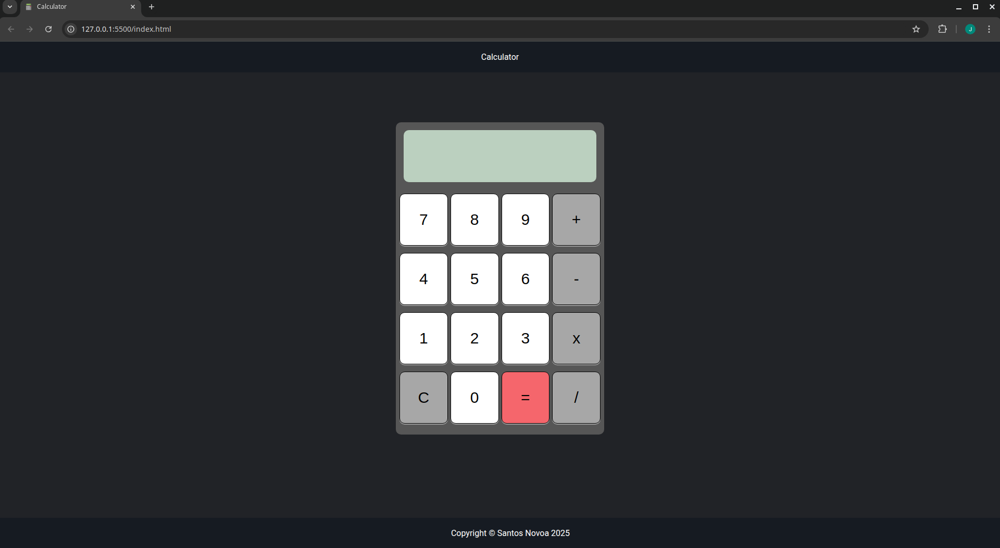

# 🔢 Calculator App

A simple and responsive web-based calculator that performs basic arithmetic operations like addition, subtraction, multiplication, and division. Built with **HTML**, **CSS**, and **JavaScript**, this calculator mimics the behavior of a traditional pocket calculator.

---

## 🚀 Features

- Clickable buttons for digits (0–9)
- Basic math operations: `+`, `-`, `x`, `/`
- Clear button to reset screen and values
- Equals button to evaluate expression
- Handles divide-by-zero with error message
- Automatically resets display when starting a new calculation

---

## 📸 Screenshot

  

---

## 🛠️ Usage

1. Clone or download this repo.
2. Open `index.html` in your browser.
3. Start calculating by clicking the buttons!

---

## 🧠 Syntax & Logic Highlights

```js
// Set up DOM elements
const screen = document.querySelector("span");
const clearBtn = document.querySelector(".clear-button");
const numBtns = document.querySelectorAll("[data-number]");
const operatorBtns = document.querySelectorAll("[data-operator]");
const equalsBtn = document.querySelector(".equal-button");

let numOne;
let numTwo;
let currentOperator;
let result;
let shouldResetScreen = false;

// Reset logic when typing after a result
function appendNumber(number) {
  if (shouldResetScreen) {
    screen.textContent = "";
    shouldResetScreen = false;
  }
  screen.textContent += number;
}

// Operator logic
function setOperator(operator) {
  numOne = parseInt(screen.textContent);
  currentOperator = operator;
  screen.textContent = "";
}

// Equals logic
equalsBtn.addEventListener("click", () => {
  numTwo = parseInt(screen.textContent);
  screen.textContent = operate(currentOperator, numOne, numTwo);
  shouldResetScreen = true;
});
